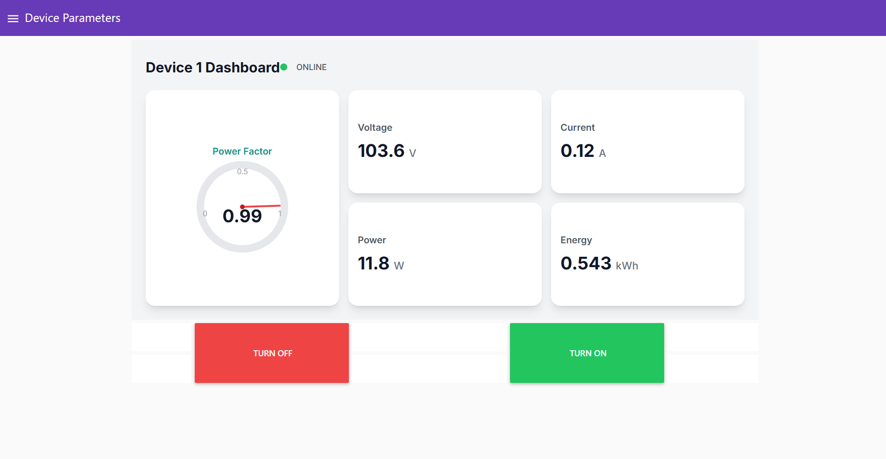

# Industrial IoT Smart Edge Device 

**A robust, hybrid sensing Smart Edge Device designed for  home energy monitoring, industrial-grade energy monitoring and protection. Features dual-protocol communication (MQTT & Modbus).**

-blue)

---

## 📖 Overview
This Smart Edge Node (SED) functions as a comprehensive data acquisition and protection unit for household and industrial loads. Unlike standard smart plugs, this device integrates **hybrid sensing** architecture: it uses a **PZEM-004T** for precision metering and features **AMC1200 Isolation Amplifier** used for galvanic isolation and transient analysis, it also executes the on/off command of load using relay.

The system is engineered to prioritize reliability in noisy electrical environments by utilizing **W5500 Ethernet** for hardwired communication, supporting both **MQTT** for cloud-server dashboards (Node-RED) and **Modbus TCP** for legacy industrial integration.

---

## 📸 Visuals
| **3D PCB Render** | **Real Device** |
|:---:|:---:|
|  |  |
| *Final PCB Design (KiCad)* | *Final PCB from the fabricator* |

> *Note: See the `/schematics` folder for the full PDF circuit diagram.*

---

## ⚡ Key Features

### 1. Hybrid Sensing Architecture
* **Precision Metering (PZEM-004T):**
    * Accurate calculation of RMS Voltage, Current, Active Power, Energy (kWh), Frequency, and Power Factor.
    * Sends this data to esp32 using UART protocol.
* **Transient Protection (AMC1200):**
    * Provides **4250V peak galvanic isolation**.
    * Feeds a high-speed analog signal to the ESP32 to detect **Voltage Surges and Dips** in real-time (sub-cycle detection), triggering safety cutoffs faster than digital sensors allow.

### 2. Industrial Connectivity
* **Ethernet (W5500):** Uses SPI interface for stable, low-latency connection, eliminating Wi-Fi instability in industrial settings.
* **Dual-Protocol Stack:**
    * **MQTT:** Publishes telemetry to a local broker for visualization on Node-RED.
    * **Modbus TCP:** Acts as a slave device, allowing PLCs or SCADA systems to poll data.

### 3. Load Control & Safety
* **30A Relay Integration:** Allows remote ON/OFF control via dashboard or automated safety disconnection during surge events.
* **Isolated Logic:** Low-voltage logic (ESP32) is completely isolated from High-Voltage mains via the AMC1200 and PC817 Optocouplers.

---
## 📊 Dashboard View
**
*Real-time monitoring interface showing energy consumption metrics and relay status.*

---
## 👨‍💻 Author
**Suvam Seth**
*Power Engineering Student | PCB Design | IoT Systems*